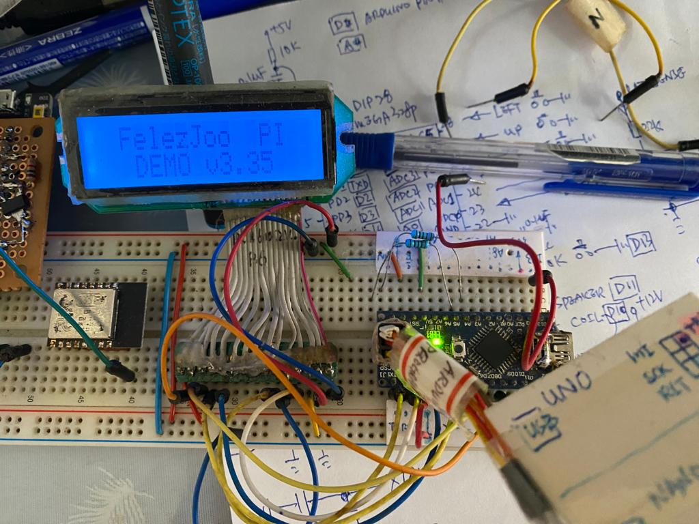
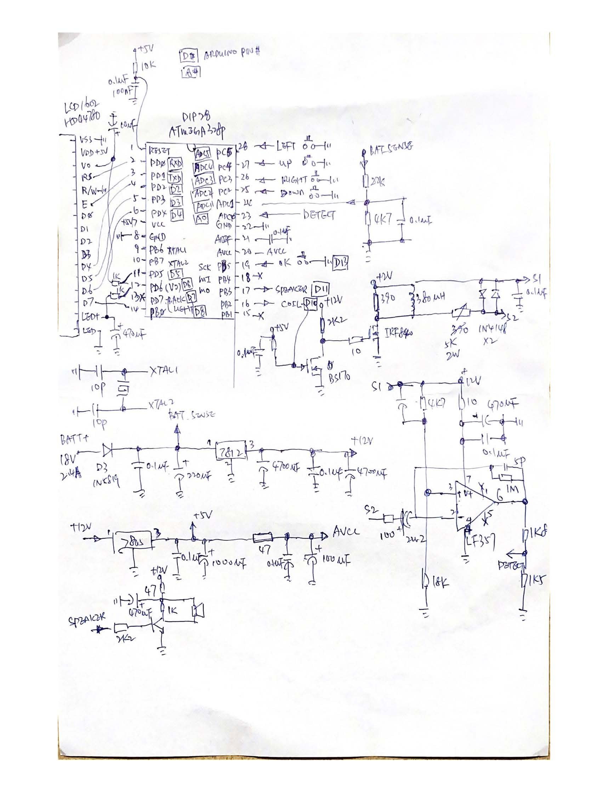

### felezjoo PI (pulse induction) metal detector 3.35 testing, 
  
  
[my_schematic.pdf](my_schematic.pdf)  
testing, LCD, powertip PC1602V-P6 MCU connection,  Arduino Nano,   
```
LCD PIN V0 = GND   
LCD PIN LED+ = 5V   
Arduino PIN TXD = LCD PIN E  
Arduino PIN RXD = LCD PIN RS  
Arduino PIN RST, no connection  
Arduino PIN GND = LCD PIN VSS
Arduino PIN D2/D3/D4/D8 = LCD PIN D4/D5/D6/D7  

Arduino PIN D13 = OK  
Arduino PIN A5 = LEFT  
Arduino PIN A4 = UP  
Arduino PIN A3 = RIGHT  
Arduino PIN A2 = DOWN  

Arduino PIN A1 = BATTERY_VOLTAGE_SENSE  
Arduino PIN A0 = METAL_DETECOR_SIGNAL  
```

### felezjoo PI (pulse induction) metal detector 3.35
伊朗 出品


```
FelezJoo PI Metal Detector (FPI)

You can build the last version (3.35) of this unique metal detector by downloading from following link. All data, files and information are included. —-Hamid— (IRAN)
```
the original author webpage, no source code, only hex, download FPI.zip  
https://felezjooblog.wordpress.com/  
the other commercial website seems like author did,  
https://www.felezjoo.com/viewtopic.php?f=8&t=2182  


the cloned or archived webpage others,  
https://simplemetaldetector.com/category/pulse-induction-metal-detectors/felezjoo-pi-metal-detector/  
